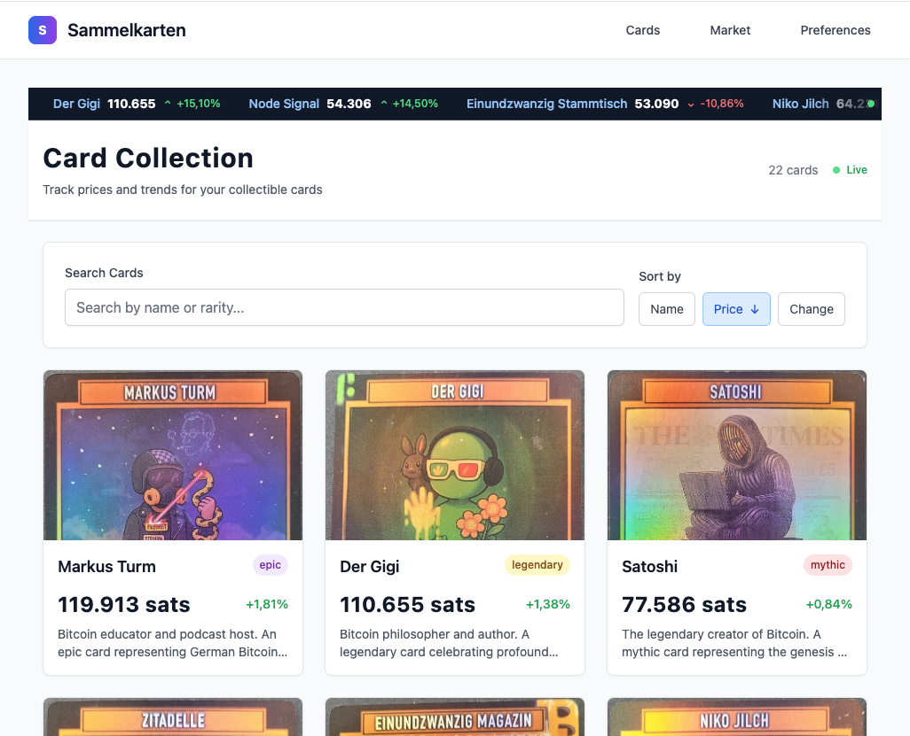

# 🃏 Sammelkarten - Sneak Preview

[](https://github.com/razue/sammelkarten/actions/workflows/elixir.yml)
[](https://codecov.io/gh/razuf/apa)
[](https://opensource.org/licenses/MIT)
[](https://github.com/razue/sammelkarten/commits/master)
[](https://github.com/razue/sammelkarten/issues)
[](https://github.com/razue/sammelkarten/pulls)
[](https://sammelkarten.fly.dev/donation)


> **Sammelkarten** - A beautiful, real-time web application for tracking collectible card values with Bitcoin-style analytics.



## Intentions - Sneak Preview

Sammelkarten is based on the idea of showcasing a powerful, real-time platform for collectors and enthusiasts to track informations and maybe the value of their collectible cards. Inspired by cryptocurrency exchanges, it provides a professional, minimalistic interface with live updates, interactive charts, and advanced analytics. After community feedback, the project can evolve to meet the needs of its users.

## ✨ Features - Sneak Preview (to play around with some)

- **Real-time Price Tracking** - Live price updates every 2 minutes with WebSocket connections
- **Interactive Charts** - Canvas-based price history charts with zoom and pan functionality
- **Market Analytics** - Comprehensive market overview with top gainers/losers
- **Responsive Design** - Clean, minimalistic interface optimized for all devices
- **Advanced Search** - Filter by name, rarity, and sort by various metrics
- **Keyboard Shortcuts** - Power user navigation and controls
- **Price Ticker** - Real-time scrolling ticker showing significant price movements
- **Admin Interface** - Password-protected database management

## 📖 Future Plans (to be discussed)

- **Localization** - Expanding language support to reach a global audience, making the platform accessible to non-English speakers.
- **Community Engagement** - Building a strong community around collectible card tracking, including forums, events, and user feedback loops.
- **AI Price Suggestions** - Implementing AI-driven price suggestions based on historical data and market trends.
- **User Profiles** - Allowing users to create profiles, track their collections, and share insights.
- **Collections** - Enabling users to create and manage collections of cards, with features for tracking ownership and value changes.
- **Social Sharing** - Options for users to share their collections and favorite cards on social media platforms.
- **Augmented Reality (AR)** - Exploring AR features for viewing cards in a virtual space, enhancing the collector experience.
- **Marketplace Integration** - Allowing users to buy, sell, and trade cards within the platform, creating a vibrant marketplace ecosystem.
- **Advanced Analytics** - Providing deeper insights into market trends, including predictive analytics and machine learning models.
- **User-Generated Content** - Enabling users to contribute content, such as card reviews, market analysis, and community-driven insights.
- **Gamification** - Introducing gamified elements like achievements, leaderboards, and challenges to enhance user engagement.
- **API Access** - Offering an API for developers to build third-party applications and integrations with Sammelkarten.
- **Data Export** - Allowing users to export their card data and analytics for personal use or integration with other tools.


## 🛠️ Technology Stack

- **Backend**: Elixir/Phoenix with LiveView for real-time updates
- **Database**: Mnesia with DETS for distributed, fault-tolerant storage
- **Frontend**: Phoenix LiveView + Tailwind CSS
- **Charts**: Custom Canvas-based charts with JavaScript hooks
- **Real-time**: Phoenix PubSub for WebSocket communication

## 🚀 Quick Start

### Prerequisites

- Elixir 1.16+ and Erlang/OTP 26+
- Node.js 18+ (for asset pipeline)

### Installation

```bash
# Clone the repository
git clone https://github.com/yourusername/sammelkarten.git
cd sammelkarten

# Install dependencies
mix setup

# Start the Phoenix server
mix phx.server
```

Visit [`localhost:4000`](http://localhost:4000) to see the application.

### Development Commands

```bash
mix phx.server          # Start development server
mix test                # Run test suite
mix format              # Format code
mix credo               # Code quality check
iex -S mix              # Interactive shell
:observer.start()       # Mnesia monitoring
```

## 📊 Project Architecture

### Core Components

- **Price Engine**: Sophisticated market simulation with rarity-based volatility
- **Real-time Updates**: Background GenServer updating prices
- **LiveView Pages**: Dashboard, individual card details, and market overview
- **Admin Interface**: Database management with authentication

### Data Models

- **Cards**: Collectible cards with metadata, pricing, and rarity information
- **Price History**: Time-series data for trend analysis and charts
- **Market Data**: Aggregated statistics and market movements

## 🎨 Design Philosophy

Inspired by modern cryptocurrency exchanges, Sammelkarten combines:

- **Minimalistic Design**: Clean interface focusing on essential information
- **Real-time Data**: Live updates without page refreshes
- **Professional UX**: Financial-grade interface for serious collectors

## 🔧 Key Features Explained

### Real-time Price Updates
- Automatic price simulation based on card rarity and market trends
- WebSocket connections for instant UI updates
- Price history tracking for comprehensive charts

### Interactive Charts
- Custom Canvas-based implementation (no external dependencies)
- Mouse wheel zooming with cursor-focused zoom
- Click-and-drag panning
- High DPI display support

### Market Analytics
- Real-time market cap calculations
- Top gainers and losers with live rankings
- Time range filtering (24h, 7d, 30d)
- Volume tracking and trend analysis

## 🎯 Current Status

**Version**: 1.0 (Production Ready)
**Milestones Completed**: 5/8
- ✅ Project Foundation & Setup
- ✅ Core Data Models & Storage
- ✅ Card Dashboard & Listing
- ✅ Individual Card Pages
- ✅ Real-time Features & Interactivity
- 🔄 UI Polish & Advanced Features (90% complete)

## 🛡️ Security & Admin

The application includes a password-protected admin interface for database management. Admin credentials are configured through environment variables.

## 📱 Responsive Design

Fully responsive design supporting:
- Desktop computers (1200px+)
- Tablets (768px - 1199px)
- Mobile phones (320px - 767px)

## 🤝 Contributing

This is an open source project. Contributions are welcome!

1. Fork the repository
2. Create a feature branch (`git checkout -b feature/amazing-feature`)
3. Commit your changes (`git commit -m 'Add amazing feature'`)
4. Push to the branch (`git push origin feature/amazing-feature`)
5. Open a Pull Request

## 📄 License

This project is licensed under the MIT License.

## 🏆 Acknowledgments

- Built with the powerful Elixir/Phoenix framework
- Uses Phoenix LiveView for seamless real-time updates
- Tailwind CSS for beautiful, responsive styling

## 🏅 Supporters

Thank you for the beautiful photos of the cards: OrangePin21!

---

**Live Demo**: [samelkarten.fly.dev](https://sammelkarten.fly.dev)

**Source Code**: [GitHub Repository](https://github.com/razue/sammelkarten)

**Donation**: [Donation](https://razue.github.io/sammelkarten/donation)


*Made with ❤️ in Bitcoin and Elixir*

